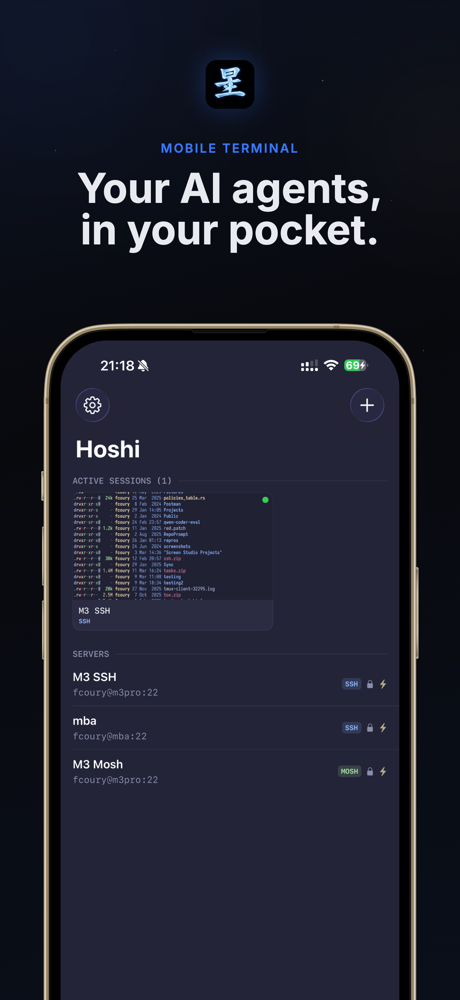
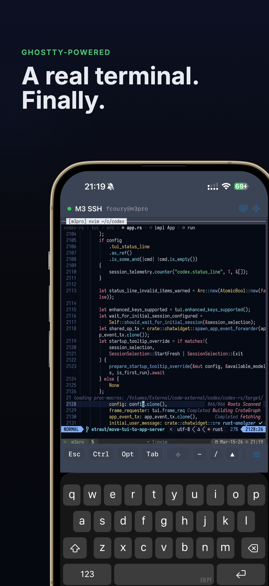
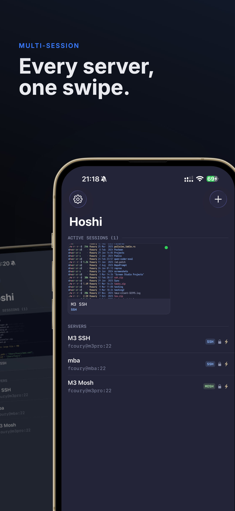

# Hoshi

A terminal app for iOS built for monitoring and interacting with AI coding agents on remote servers. Connect over **Mosh** or **SSH**, pick a **tmux** session, and get to work — all from your phone.

Hoshi (星, "star" in Japanese) is designed around a specific workflow: connect → pick tmux session → check agent status → send input → disconnect. It prioritizes mobile-friendly terminal interaction with gesture controls, a customizable keyboard toolbar, and Metal-accelerated rendering powered by [Ghostty](https://ghostty.org).

<a href="https://apps.apple.com/app/id6760631255">
  
</a>

<p align="center">
  
  &nbsp;&nbsp;
  
  &nbsp;&nbsp;
  
</p>

## Features

### Connections

- **Mosh (Mobile Shell)** — UDP-based protocol that survives network changes, sleep, and roaming
- **SSH** — full PTY support with automatic reconnection
- Password and SSH key authentication (Ed25519, RSA)
- Up to 5 concurrent sessions with a carousel UI for quick switching

### tmux Integration

- Automatic session detection on connect
- Session picker showing name, window count, and attached status
- Auto-attach to saved sessions
- Option to create a new session or skip to a raw shell

### Terminal

- Powered by [Ghostty](https://ghostty.org) with Metal-accelerated rendering
- xterm-256color with true color (24-bit) support
- Unicode/UTF-8 and CJK character support
- Scrollback buffer with gesture-based scrolling
- Pinch-to-zoom font size adjustment
- 50+ bundled Nerd Fonts

### Keyboard Toolbar

- Fully customizable button bar with drag-to-reorder
- Sticky modifiers — Ctrl, Opt/Alt, and Shift apply to the next keystroke
- Swipe-to-arrow controls — drag gestures emit arrow keys
- Esc, Tab, function keys, symbols, and common combos (^C, ^D, ^Z)

### Touch & Gestures

- Tap to click (for vim, htop, URLs)
- Long press + drag for mouse selection
- One-finger pan to scroll the terminal buffer
- Pinch to adjust font size
- Scrollbar overlay indicator

### Appearance

- 6 built-in dark themes: Nord, Dracula, Solarized Dark, Gruvbox Dark, Tokyo Night, Catppuccin Mocha
- Cursor style configuration (block, beam, underline)
- Background opacity control
- Scroll speed multiplier
- Haptic feedback throughout

## Tech Stack

- **Swift 5.9** / **SwiftUI** — iOS 18.0+
- **GhosttyKit** — Metal-accelerated terminal rendering via embedded xcframework
- **Citadel** — SSH client library
- **CryptoSwift** — AES-OCB encryption for the Mosh protocol
- **SwiftData** — local persistence for server profiles
- **Keychain Services** — credential storage

The Mosh protocol is implemented from scratch in Swift, including UDP transport, SSP (State Synchronization Protocol), and AES-OCB encryption.

## Building

Hoshi uses [XcodeGen](https://github.com/yonaskolb/XcodeGen) to generate its Xcode project.

```bash
# Install XcodeGen if needed
brew install xcodegen

# Generate the Xcode project
cd Hoshi
xcodegen generate

# Open in Xcode
open Hoshi.xcodeproj
```

The Ghostty framework is included as a Git submodule under `vendor/ghostty`. Make sure to initialize submodules:

```bash
git submodule update --init --recursive
```

## License

This project is not yet licensed. All rights reserved.
