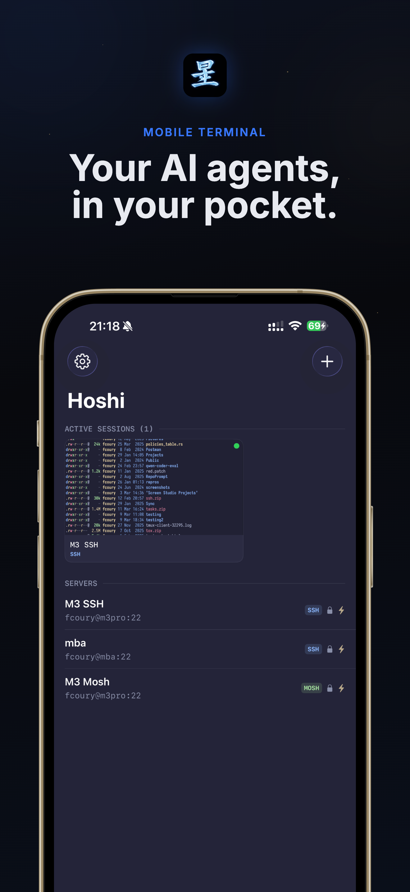
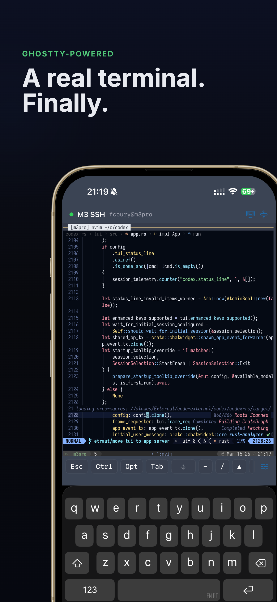
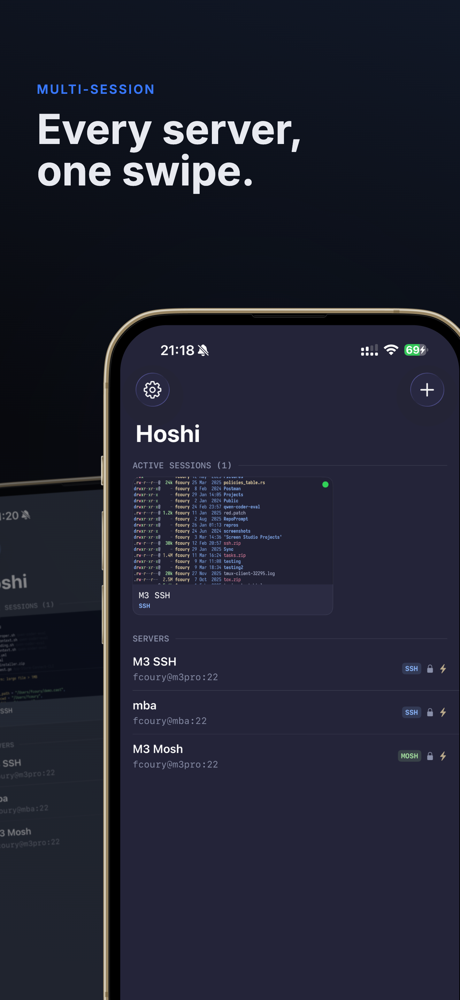

# Hoshi

A terminal app for iOS built for monitoring and interacting with AI coding agents on remote servers. Connect over **Mosh** or **SSH**, pick a **tmux** session, and get to work — all from your phone.

Hoshi (星, "star" in Japanese) is designed around a specific workflow: connect → pick tmux session → check agent status → send input → disconnect. It prioritizes mobile-friendly terminal interaction with gesture controls, a customizable keyboard toolbar, and Metal-accelerated rendering powered by [Ghostty](https://ghostty.org).

<a href="https://apps.apple.com/app/id6760631255">
  
</a>

<p align="center">
  
  &nbsp;&nbsp;
  
  &nbsp;&nbsp;
  
</p>

## Features

### Connections

- **Mosh (Mobile Shell)** — UDP-based protocol that survives network changes, sleep, and roaming
- **SSH** — full PTY support with automatic reconnection
- Password and SSH key authentication (Ed25519, RSA)
- Up to 5 concurrent sessions with a carousel UI for quick switching

### tmux Integration

- Automatic session detection on connect
- Session picker showing name, window count, attached status, and recent activity
- Auto-attach to saved sessions
- Named session creation or an explicit raw-shell fallback
- Configurable tmux command palette, prefix, and custom byte sequences

### Coding Agent Monitoring

- Local-first inbox for completed jobs, attention requests, and approvals
- Per-session attention badges and optional local notifications
- Notification deep links reopen the relevant terminal
- Versioned terminal hooks for direct SSH connections
- Optional bearer-token-protected, self-hosted companion for tmux and Mosh
- No account, mandatory cloud service, or automatically executed approvals

### Private Voice Prompts

- Push-to-talk dictation using on-device speech recognition only
- Editable, in-memory drafts with no saved audio or transcripts
- Insert text without Return, or explicitly confirm submitting it
- Configurable language and recording limits
- Drafts and recording are cleared when Hoshi locks or backgrounds

### Secure File and Image Uploads

- Select documents or photos without granting full photo-library access
- Encrypted SFTP uploads over pinned, host-key-verified SSH connections
- Existing SSH sessions are reused; Mosh sessions open a separately verified SSH transfer connection
- Home-directory-only destinations, unique filenames, private permissions, and atomic completion
- Progress reporting, cancellation, and automatic partial-file cleanup
- Optional shell-quoted remote path insertion without executing Return

### Terminal

- Powered by [Ghostty](https://ghostty.org) with Metal-accelerated rendering
- xterm-256color with true color (24-bit) support
- Unicode/UTF-8 and CJK character support
- Scrollback buffer with gesture-based scrolling
- Pinch-to-zoom font size adjustment
- 50+ bundled Nerd Fonts

### Keyboard Toolbar

- Fully customizable button bar with drag-to-reorder
- Sticky modifiers — Ctrl, Opt/Alt, and Shift apply to the next keystroke
- Swipe-to-arrow controls — drag gestures emit arrow keys
- Esc, Tab, function keys, symbols, and common combos (^C, ^D, ^Z)
- Customizable microphone action for private voice prompt composition
- Customizable file-upload action for documents and photos

### Touch & Gestures

- Tap to click (for vim, htop, URLs)
- Long press + drag for mouse selection
- One-finger pan to scroll the terminal buffer
- Pinch to adjust font size
- Scrollbar overlay indicator

### Appearance

- Dark and light terminal themes, including Nord, Dracula, Solarized Dark, Solarized Light, Gruvbox Dark, Tokyo Night, and Catppuccin Mocha
- Cursor style configuration (block, beam, underline)
- Background opacity control
- Scroll speed multiplier
- Haptic feedback throughout

## Tech Stack

- **Swift 5.9** / **SwiftUI** — iOS 18.0+
- **GhosttyKit** — Metal-accelerated terminal rendering via embedded xcframework
- **Citadel** — SSH client library
- **CryptoSwift** — AES-OCB encryption for the Mosh protocol
- **SwiftData** — local persistence for server profiles
- **Keychain Services** — credential storage
- **Speech / AVFoundation** — strictly on-device voice prompt dictation

The Mosh protocol is implemented from scratch in Swift, including UDP transport, SSP (State Synchronization Protocol), and AES-OCB encryption.

## Building

Hoshi requires a full Xcode installation with the iOS SDK, plus
[XcodeGen](https://github.com/yonaskolb/XcodeGen), Zig 0.15.2, and
ripgrep. Its generated Ghostty framework is not committed, so initialize the
submodules and build the framework before opening the project.

```bash
# Select and initialize the full Xcode installation once
sudo xcode-select --switch /Applications/Xcode.app/Contents/Developer
sudo xcodebuild -runFirstLaunch

# Install the build prerequisites
brew install xcodegen zig@0.15 ripgrep

# Recent Xcode versions also require the separate Metal compiler toolchain
xcodebuild -downloadComponent MetalToolchain -buildVersion \
  "$(xcodebuild -showComponent MetalToolchain -json | plutil -extract buildVersion raw -)"

# Install an iOS simulator runtime when running the unit tests locally
xcodebuild -downloadPlatform iOS -architectureVariant arm64

# From the repository root, initialize submodules, build GhosttyKit,
# and generate the checked-in Xcode project
./scripts/bootstrap.sh

# Open in Xcode
open Hoshi/Hoshi.xcodeproj
```

To prepare the pieces separately:

```bash
git submodule update --init --recursive -- vendor/ghostty vendor/libxev
./scripts/build-ghosttykit.sh
xcodegen --spec Hoshi/project.yml --project Hoshi
```

Live Mosh integration tests are skipped unless `HOSHI_MOSH_HOST`,
`HOSHI_MOSH_USER`, and `HOSHI_MOSH_PASSWORD` are all set explicitly.

## Agent Hooks and Self-Hosted Companion

Agent events use a versioned JSON envelope with one of three kinds:
`completed`, `needs_attention`, or `approval_requested`. Approval events only
open the related terminal; Hoshi never executes a remotely supplied command.

For a direct SSH terminal, emit an event into the terminal stream:

```bash
python3 scripts/hoshi-agent-companion.py emit completed \
  --title "Agent finished" \
  --message "Tests passed and the patch is ready"
```

tmux and Mosh can consume terminal escape sequences before they reach an iOS
client. For those connections, run the optional standard-library-only Python
companion on your own server:

```bash
# Generate a local bearer token; never commit it to the repository.
export HOSHI_AGENT_TOKEN="$(python3 -c 'import secrets; print(secrets.token_urlsafe(32))')"

# Listen on loopback only. Put a trusted HTTPS reverse proxy in front when the
# iPhone or iPad connects from another device.
python3 scripts/hoshi-agent-companion.py serve --port 8765

# In a shell hook or agent callback, post an event to that companion.
export HOSHI_AGENT_COMPANION_URL="http://127.0.0.1:8765/events"
python3 scripts/hoshi-agent-companion.py emit approval_requested \
  --title "Approval required" \
  --message "Review the requested changes" \
  --tmux-session coding-agents
```

In Hoshi, open **Settings → Coding Agents → Agent Monitoring**, enter the
public HTTPS `/events` endpoint and the same bearer token, then enable agent
notifications if desired. HTTP is accepted only for loopback development;
remote endpoints require HTTPS. The bearer token is stored in the iOS Keychain,
not in server profiles or the event archive.

The companion is polled while Hoshi is active. iOS may suspend networking when
the app is backgrounded; this local-first integration does not claim to provide
always-on remote push notifications.

See [docs/agent-events.md](docs/agent-events.md) for the complete event and
companion HTTP protocol.

## License

This project is not yet licensed. All rights reserved.
